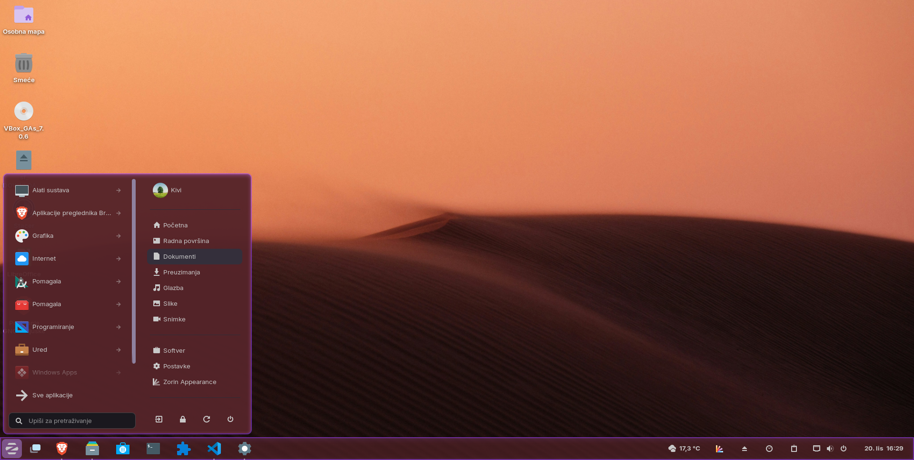

# CSS Gnommé - Dynamic Theme Overlay for GNOME Shell

**CSS Gnommé** is a GNOME Shell extension for **GNOME 43-44** (Zorin OS 17.3) that creates dynamic theme overlays with automatic wallpaper color extraction, advanced blur effects, and customizable transparency. Enhance your desktop appearance without modifying original theme files - everything is completely reversible.



---

## ✨ Features

### 🔄 **Dynamic Theme Overlay System**

- **Non-Destructive**: Creates a custom theme overlay that inherits from your current GTK theme
- **Live Updates**: Automatically updates CSS when settings change
- **One-Click Toggle**: Enable/disable the overlay system without losing your configuration
- **Theme Preservation**: Automatically restores your original theme when disabling the overlay

### 🎨 **Automatic Wallpaper Color Extraction**

- **Smart Analysis**: Automatically extracts dominant and accent colors from your desktop background using advanced K-means clustering algorithm
- **Intelligent Application**: Applies extracted colors to panel backgrounds, popup menus, and accent borders
- **Light/Dark Detection**: Automatically adjusts color intensity based on your theme brightness
- **Manual Control**: Extract colors on-demand with one click from the system tray menu

### 🌫️ **Advanced Blur Effects**

- **Full Backdrop Control**: Adjust blur radius (1-50px), saturation, contrast, and brightness independently
- **Custom Tinting**: Apply semi-transparent color overlays for unique glass effects
- **Border Customization**: Define border color, width (0-5px), and opacity for framed appearance
- **Universal Application**: Blur effects apply to popup menus, Alt+Tab switcher, and other shell elements

### 🖥️ **Zorin OS Integration**

- **Taskbar Enhancement**: Special integration with Zorin Taskbar for consistent styling
- **Floating Panel Effect**: Automatically enables floating panel effect when border-radius is applied
- **Tint Control**: Reduces Zorin theme color tint intensity for cleaner appearance
- **Shell Component Styling**: Enhanced visual consistency across panels, menus, and system UI

### 🎛️ **Customizable Transparency**

- **Panel Opacity**: Control main taskbar/panel transparency (10-100%)
- **Menu Opacity**: Separate opacity control for popup menus (10-100%)
- **Color Overrides**: Manually set panel and popup background colors with full RGBA support
- **Border Radius**: Auto-detect or manually set rounded corners (0-25px)

---

## 🖼️ Screenshots

**Additional Screenshots:**

- [Border Effects](docs/screenshot-border-menu.png)
- [Quick Settings](docs/screenshot-border-quicksettings.png)
- [More examples in docs/](docs/)

---

## � Requirements

**Supported GNOME Shell Versions:**

- GNOME 43 (Zorin OS 17.3)
- GNOME 44

**Tested On:**

- Zorin OS 17.3 Core (Primary target)

**Not Compatible With:**

- GNOME 45+ (breaking API changes - see ZorinOS 18 version)
- GNOME 42 and earlier (missing required APIs)

---

## �📥 Installation

### Option 1: GNOME Extensions Website (Recommended)

1. Visit [GNOME Extensions](https://extensions.gnome.org/)
2. Search for "CSS Gnommé"
3. Click the toggle switch to install
4. Enable in GNOME Extensions app

### Option 2: Manual Installation

1. Download the latest release from [GitHub Releases](https://github.com/drdrummie/CSSGnomme-ZorinOS17/releases)
2. Extract the archive:

   ```bash
   unzip cssgnomme@dr.drummie.zip -d ~/.local/share/gnome-shell/extensions/cssgnomme@dr.drummie/
   ```

3. Restart GNOME Shell:
   - **X11**: Press `Alt+F2`, type `r`, press Enter
   - **Wayland**: Log out and log back in
4. Enable the extension:

   ```bash
   gnome-extensions enable cssgnomme@dr.drummie
   ```

### Option 3: Build from Source

```bash
git clone https://github.com/drdrummie/CSSGnomme-ZorinOS17.git
cd CSSGnomme-ZorinOS17
make install
```

Then restart GNOME Shell and enable the extension.

---

## 🎯 Quick Start

### Getting Started

1. **Enable the Extension**: Use GNOME Extensions app or the system tray icon
2. **Open Preferences**: Click the system tray icon → "Open Settings"
3. **Choose Base Theme**: Select your preferred GTK theme from the dropdown
4. **Enable Overlay**: Toggle "Enable Overlay Theme" to activate
5. **Customize**: Adjust transparency, blur effects, and colors to your liking
6. **Disable notifications**: If too distracting for your taste

### Quick Actions (System Tray Menu)

- **Extract Colors from Wallpaper**: One-click color extraction
- **Enable/Disable Overlay**: Quick toggle without opening preferences
- **Open Settings**: Open full settings dialog

For detailed setup instructions, see [Quick Guide](docs/QUICK_GUIDE_ZOS17.md).

## � Troubleshooting

**Extension not appearing after install:**

- Restart GNOME Shell (Alt+F2 → 'r' on X11, or logout/login on Wayland)
- Check if enabled: `gnome-extensions list --enabled | grep cssgnomme`

**Colors not extracting:**

- Ensure wallpaper is set (not solid color background)
- Try manual extraction via extension menu
- Check logs: `journalctl -f -o cat /usr/bin/gnome-shell | grep CSSGnomme`

**Zorin integration not working:**

- Ensure Zorin Taskbar extension is enabled
- Restart GNOME Shell after enabling both extensions

**Performance issues:**

- Reduce blur radius (lower values = better performance)
- Disable "Auto-extract on wallpaper change" if not needed
- Restart GNOME Shell periodically on GNOME 43 due to memory leaks

**Advanced Troubleshooting:**

```bash
# Check extension logs
journalctl -f -o cat /usr/bin/gnome-shell | grep CSSGnomme

# Reset all settings
dconf reset -f /org/gnome/shell/extensions/cssgnomme/

# List enabled extensions
gnome-extensions list --enabled
```

---

## ⚠️ Known Limitations

- **GNOME 43 Memory Leaks**: Wallpaper changes cause memory leaks (external GNOME Shell bug)
- **Theme Compatibility**: Overlay theme inherits from current GTK theme (some themes may have compatibility issues)
- **Color Extraction**: Requires valid image wallpaper (not solid colors or gradients)
- **Performance**: Complex blur effects may impact performance on older hardware

See [KNOWN_ISSUES.md](docs/KNOWN_ISSUES.md) for detailed list of limitations and workarounds.

**Quick Summary:**

- **Wallpaper Memory Leak**: GNOME Shell 43.9 has a memory leak with wallpaper changes (external bug). Avoid frequent wallpaper switching.
- **Dark/Light Toggle Performance**: Multiple theme toggles can impact performance. Restart GNOME Shell if needed.
- **GdkPixbuf Memory**: Minor memory residual after color extraction (~0.1-0.2MB per wallpaper).
- **Could affect apps too but it can be adjusted (i.e. remove transparency and / or choose wanted color manually)**

---

## � Tips & Tricks

**Best Performance:**

- Use moderate blur radius (10-20px) for best balance
- Disable auto-color extraction if you don't change wallpapers often
- Restart GNOME Shell periodically to clear GNOME 43 memory leaks

**Visual Consistency:**

- Match border-radius across all elements for cohesive look
- Use extracted colors for best integration with wallpaper
- Adjust saturation for more vibrant or muted appearance

**Troubleshooting:**

- If UI doesn't update: Restart GNOME Shell (`Alt+F2` → `r` on X11)
- If colors look wrong: Re-extract from wallpaper
- If performance issues: Reduce blur radius or disable blur
- For memory issues: Avoid frequent wallpaper changes (GNOME 43 bug)

---

## 💡 Tips & Tricks

**Best Performance:**

- Disable auto-color extraction if you don't change wallpapers often
- Set your desired "style"
- Use moderate blur radius (10-20px) for best balance

**Visual Consistency:**

- Match border-radius across all elements for cohesive look
- Use extracted colors for best integration with wallpaper
- Adjust saturation for more vibrant or muted appearance

**Troubleshooting:**

- If you encounter hangs, system is probably low on memory (i.e. lot of wallpaper changes + dark | light theme switching)
- If UI doesn't update: Restart GNOME Shell (`Alt+F2` → `r` on X11)
- If colors look wrong: Re-extract from wallpaper
- If performance issues: Reduce blur radius or disable blur

---

## �📄 License

This project is licensed under the **GNU General Public License v3.0** - see [LICENSE](LICENSE) for details.

---

## 👤 Author

**dr.drummie**

- GitHub: [@drdrummie](https://github.com/drdrummie)
- Repository: [CSSGnomme-ZorinOS17](https://github.com/drdrummie/CSSGnomme-ZorinOS17)

---

## 🙏 Acknowledgments

- GNOME Shell team for the extension API
- Zorin OS team for the excellent desktop environment
- Open Bar extension for color extraction inspiration
- CSS Panels extension for Cinnamon Mint

**Enjoy your customized GNOME Shell experience!** ✨
