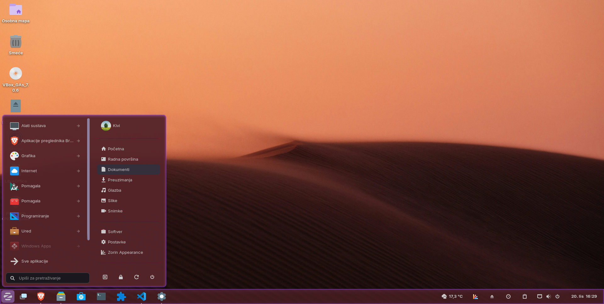

# CSS Gnommé - Dynamic Theme Overlay for GNOME Shell

**CSS Gnommé** is a GNOME Shell extension for **GNOME 43-44** (Zorin OS 17.3) that creates dynamic theme overlays with automatic wallpaper color extraction, advanced blur effects, and customizable transparency. Enhance your desktop appearance without modifying original theme files - everything is completely reversible.



---

## ✨ Features

### 🔄 **Dynamic Theme Overlay System**
- **Non-Destructive**: Creates a custom theme overlay in `~/.themes/CSSGnomme/` that inherits from your current GTK theme
- **Live Updates**: Auto-updates CSS when settings change (2-second debounce for smooth transitions)
- **One-Click Toggle**: Enable/disable overlay system without losing your configuration
- **Theme Preservation**: Automatically restores your original theme when disabling the overlay

### 🎨 **Automatic Color Extraction**
- **Wallpaper Analysis**: Automatically extracts dominant and accent colors from your desktop background using K-means clustering
- **Smart Application**: Applies extracted colors to panel backgrounds, popup menus, and accent borders
- **Manual Trigger**: Extract colors on-demand with one click from the system tray menu


### 🌫️ **Advanced Blur Effects**
- **Full Backdrop Filter Control**: Adjust blur radius (1-50px), saturation (0.4-2.0), contrast (0.4-2.0), and brightness (0.4-2.0)
- **Border Customization**: Define border color, width (0-5px), and opacity for framed appearance
- **Dynamic Shadows**: Real-time shadow calculation with adjustable strength (0.0-1.0)
- **Universal Application**: Blur effects apply to popup menus, Alt+Tab switcher, and other shell elements

### 🖥️ **Zorin OS Integration**
- **Taskbar Enhancement**: Special integration with Zorin Taskbar for consistent styling
- **Floating Panel Effect**: Automatically enables Zorin intellihide for floating panel when border-radius is applied
- **Tint Control**: Adjust Zorin theme color tint intensity (0-100%) for more neutral or vibrant appearance
- **Shell Component Styling**: Enhanced visual consistency across panels, menus, and system UI

### 🎛️ **Customizable Transparency**
- **Panel Opacity**: Control main taskbar/panel transparency (0-100%)
- **Menu Opacity**: Separate opacity control for popup menus (0-100%)
- **Color Overrides**: Manually set panel and popup background colors with RGBA support
- **Border Radius**: Auto-detect or manually set rounded corners (0-25px)

### 🎨 **Advanced Features (v1.5.4)**
- **Manual Icon Theme Override**: Independent icon selection with auto-detect fallback

---

## 🖼️ Screenshots

**Additional Screenshots:**
- [Border Effects (menu)](docs/screenshot-border-menu.png)
- [Quick Settings](docs/screenshot-border-quicksettings.png)
- [More examples in docs/](docs/)

---

## 📦 Requirements

**Supported GNOME Shell Versions:**
- GNOME 43 (Zorin OS 17.3)
- GNOME 44

**Tested On:**
- Zorin OS 17.3 Core (Primary target)

**Not Compatible With:**
- GNOME 45+ (breaking API changes - see ZorinOS 18 version)
- GNOME 42 and earlier (missing required APIs)

---

## 📥 Installation

### Option 1: GNOME Extensions Website (Recommended)

1. Visit [GNOME Extensions](https://extensions.gnome.org/)
2. Search for "CSS Gnommé"
3. Click the toggle switch to install
4. Enable in GNOME Extensions app

### Option 2: Manual Installation

1. Download the latest release from [GitHub Releases](https://github.com/drdrummie/CSSGnomme-ZorinOS17/releases)
2. Extract the archive:

   ```bash
   unzip cssgnomme@dr.drummie.zip -d ~/.local/share/gnome-shell/extensions/cssgnomme@dr.drummie/
   ```

3. Restart GNOME Shell:
   - **X11**: Press `Alt+F2`, type `r`, press Enter
   - **Wayland**: Log out and log back in
4. Enable the extension:

   ```bash
   gnome-extensions enable cssgnomme@dr.drummie
   ```

### Option 3: Build from Source

```bash
git clone https://github.com/drdrummie/CSSGnomme-ZorinOS17.git
cd CSSGnomme-ZorinOS17
make install
```

Then restart GNOME Shell and enable the extension.

---

## 🚀 Quick Start

### First-Time Setup (5 minutes)

1. **Enable the Extension**:
   - Open Extensions app → Enable "CSS Gnommé"
   - Click the settings gear icon

2. **Activate Overlay System**:
   - Go to "Theme Overlay" tab
   - Select your preferred "Base Theme"
   - Toggle "Enable Overlay Theme" → ON

3. **Extract Colors from Wallpaper**:
   - Toggle "Auto-detect colors on wallpaper change" → ON
   - Click "Extract Colors Now" to see immediate results

4. **Fine-tune Transparency**:
   - Go to "Color Settings" tab
   - Adjust "Panel Opacity" (try 70% for glass effect)
   - Adjust "Menu Opacity" (try 80% for readability)

5. **Add Blur Effects** (Optional):
   - Go to "Blur Effects" tab
   - Set "Blur radius" to 25px
   - Adjust saturation/contrast to taste

---

## ⚙️ Configuration

Access settings through:
- **System Tray Icon**: Click the theme icon → "Open Settings"
- **Extensions App**: Find "CSS Gnommé" → Settings button
- **Quick Menu**: System tray icon provides quick actions for color extraction and overlay toggling

---

## 🔧 Troubleshooting

**Extension not appearing after install:**
- Restart GNOME Shell (Alt+F2 → 'r' on X11, or logout/login on Wayland)
- Check if enabled: `gnome-extensions list --enabled | grep cssgnomme`

**Colors not extracting:**
- Ensure wallpaper is set (not solid color background)
- Try manual extraction via extension menu
- Check logs: `journalctl -f -o cat /usr/bin/gnome-shell | grep CSSGnomme`

**Zorin integration not working:**
- Ensure Zorin Taskbar extension is enabled
- Restart GNOME Shell after enabling both extensions

**Performance issues:**
- Reduce blur radius (lower values = better performance)
- Disable "Auto-extract on wallpaper change" if not needed
- Restart GNOME Shell periodically on GNOME 43 due to platform memory leaks

**Advanced Troubleshooting:**

```bash
# Check extension logs
journalctl -f -o cat /usr/bin/gnome-shell | grep CSSGnomme

# Reset all settings
dconf reset -f /org/gnome/shell/extensions/cssgnomme/

# List enabled extensions
gnome-extensions list --enabled
```

---

## ⚠️ Known Limitations


**See:** [KNOWN_ISSUES.md](docs/KNOWN_ISSUES.md) for complete technical analysis

---

## 💡 Tips & Tricks

**Best Performance:**
- Disable auto-color extraction if you don't change wallpapers often
- Use moderate blur radius (10-20px) for best balance
- Restart GNOME Shell weekly to clear accumulated memory

**Visual Consistency:**
- Match border-radius across all elements for cohesive look
- Use extracted colors for best integration with wallpaper
- Adjust saturation for more vibrant or muted appearance


---

## 📄 License

This project is licensed under the **GNU General Public License v3.0** - see [LICENSE](LICENSE) for details.

---

## 👤 Author

**dr.drummie**

- GitHub: [@drdrummie](https://github.com/drdrummie)
- Repository: [CSSGnomme-ZorinOS17](https://github.com/drdrummie/CSSGnomme-ZorinOS17)

---

## 🙏 Acknowledgments

- GNOME Shell team for the extension API
- Zorin OS team for the excellent desktop environment
- Open Bar extension for color extraction inspiration
- CSS Panels extension for Cinnamon Mint

**Enjoy your customized GNOME Shell experience!** ✨
